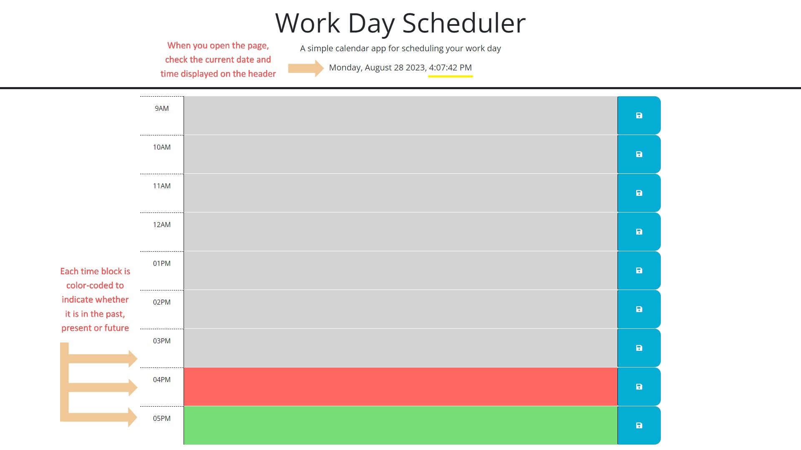
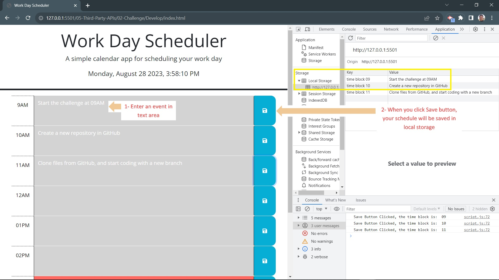
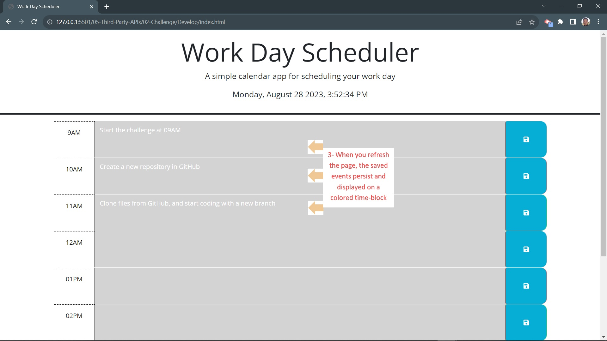

# Module05-Challenge_HuiPan
HuiPan's Work Day Scheduler
```
Development Tool: MS VS Code Version:1.81.0;
Third-party Plug-ins: jquery-3.4.1.min.js; dayjs-1.11.3; bootstrap-5.1.3; GoogleFonts-Open Sans
Deployment Platform: GitHub;
Special Feature: Use HTML custom data-* attributes to allocate each textarea with an unique time ID
```
## User Story
```
AS AN employee with a busy schedule
I WANT to add important events to a daily planner
SO THAT I can manage my time effectively
```
## Acceptance Criteria
```
GIVEN I am using a daily planner to create a schedule
WHEN I open the planner
THEN the current day is displayed at the top of the calendar
WHEN I scroll down
THEN I am presented with time blocks for standard business hours of 9am to 5pm
WHEN I view the time blocks for that day
THEN each time block is color-coded to indicate whether it is in the past, present, or future
WHEN I click into a time block
THEN I can enter an event
WHEN I click the save button for that time block
THEN the text for that event is saved in local storage
WHEN I refresh the page
THEN the saved events persist
```
## Usage
GitHub folder: https://github.com/HuiPan_WorkDayScheduler/Screenshots-User%20Guide
```




```
## Deployment and Pages
- URL Link: https://huipan-peter.github.io/HuiPan_WorkDayScheduler/
- Repository Link: https://github.com/HuiPan-Peter/HuiPan_WorkDayScheduler